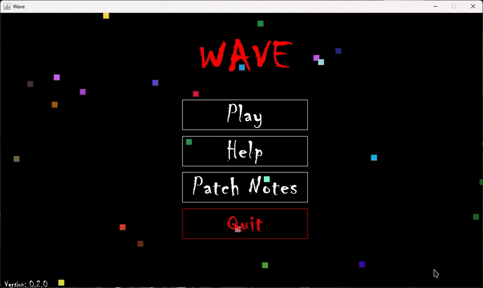
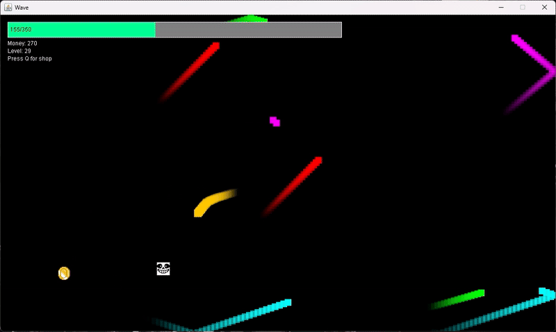
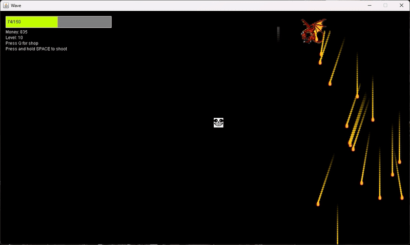

# Wave (Decompiled High School Project)

This repository contains a **decompiled and partially restored version** of *Wave*, a game I originally developed during high school.  
Because this version was reconstructed from the original executable, the project is **not buildable from source**. The code is provided here for **portfolio and archival purposes only**, to demonstrate my ability to recover, refactor, and document legacy projects.

---

## ⚠️ Important Notes
- This is **not the original source code** — it was decompiled and cleaned up for readability.  
- The project cannot be compiled into a working build.  
- To experience the game, you’ll need to run the original executable.

---

## 🕹️ Game Overview
*Wave* is a fast-paced **bullet hell** with roguelike elements.  
It features:
- **30 levels** of escalating difficulty.  
- **3 unique bosses**, each with distinct attack patterns.  
- **Two modes**:  
  - *Normal Mode* – standard progression.  
  - *Hard Mode* – tougher enemies and mirrored (“specular”) bosses for an extra challenge.  

---

## 💡 Core Features
- **Endless Upgrade Shop**  
  Earn points by defeating bosses and surviving waves, then spend them on infinite upgrades to push further each run.  

- **Character Skins**  
  Choose from several premade skins during character selection.  

- **Roguelike Gameplay**  
  Each playthrough starts fresh — no upgrades carry over between runs, keeping the challenge alive.  

---

## 🎥 Demonstration

| Character Selection | Intermission | First Bossfight |
|---------------------|--------------|-----------------|
|  |  |  |

| Specular Bossfight | Game Over |
|--------------------|-----------|
|  |  |

---

## 🚧 Future Development
I am currently working on a **Unity DOTS reimagining** of *Wave*, evolving it into a **roguelite** with persistent progression between runs.  
- The repository is private for now.  
- It will be made public once the first alpha is playable.
  
---

## 📂 Repository Purpose
This repo is meant to:
- Showcase my **code recovery and documentation workflow**.  
- Demonstrate how I handle **legacy projects** with missing or corrupted source.  
- Provide a clear example of my **technical resilience and growth** since high school.

---

## 🔧 Technical Notes
- Decompiled from the original `.exe` using Java decompilation tools.  
- Refactored for readability and maintainability.  
- Documented with comments and structured into a professional folder hierarchy.  

---

## 📜 License
This project is shared for **educational and portfolio purposes only**.  
Please do not redistribute the binary or use the code for commercial purposes.
